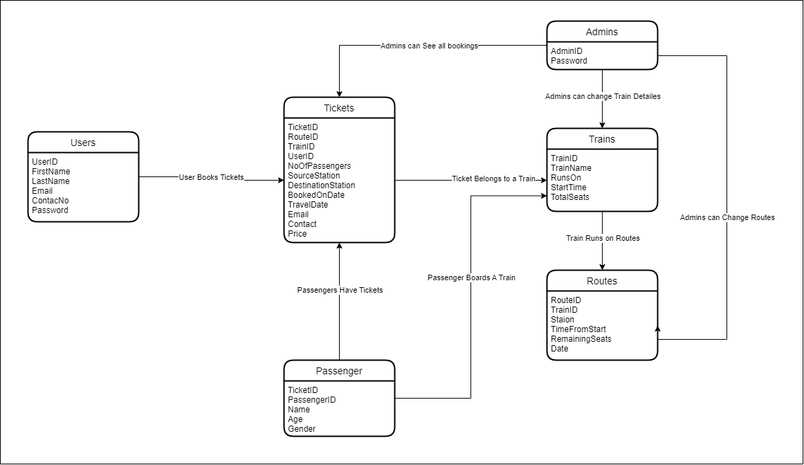

### Indian Railway Reservation System (IRRS) - DBMS Project
## Problem Statement
India's railway system, one of the most complex in the world, requires an efficient management system. The objective of this project is to design a database-driven online railway ticket reservation system to streamline operations and improve user experience. The system aims to accomplish the following:

1.Create and maintain a comprehensive database of trains.
2.Provide search capabilities for train schedules, including arrival and departure times, and distances between stations.
3.Offer real-time ticket availability checking.
4.Calculate fares based on travel details.
5.Enable easy ticket booking for users.
6.Allow users to cancel tickets as needed.
7.The system will feature an online interface where users can access real-time information about train schedules, ticket availability, and pricing. It is designed to meet the needs of both registered and guest users, with specific functionalities tailored to each group.

## Objectives
1.To provide a structured framework for managing the vast railway network efficiently.
2.To restrict administrative controls to designated personnel while maintaining a user-friendly interface for the public.
3.To enhance the functionality and flexibility of the railway reservation process, making it accessible and straightforward for all users.
4.To address common and unique challenges associated with railway operations through a comprehensive set of digital tools.
## Purpose of the IRRS
Owned by the Ministry of Railways, Government of India, Indian Railways operates the fourth-largest railway network in the world by size, covering 67,956 km with over 7,325 stations. It handles millions of passengers daily across 13,169 passenger trains. Manual management of such a large system is challenging and inefficient. The automation of this system through IRRS will streamline processes, making data and record management more manageable and effective.

## Features of IRRS
1.**Real-time Information**: IRRS provides immediate updates on ticket prices and availability.
2.**Ticket Access and Printing**: Registered users can access and print their tickets anytime.
3.**Comprehensive Search Functionality**: Both registered and guest users can search for train availability, prices, schedules, distances, and routes.
4.**Admin Management**: Administrators can update train details and view all user bookings.
5.**Cancellation Policy**: Users can cancel tickets without penalty under specific conditions.
6.**Data Security**: Ensures the protection and confidentiality of user data.

# Use Case Diagram


# ER Model

## Removal of Non-Binary Relationship


## Adding Attributes to Entities


# Relation Model and Normalization



| Entities | Attributes |
| --- | --- |
| Users | UserID, Email, ContactNo, FirstName, LastName, Password |
| Trains | TrainID, TrainName, RunsOn, StartTime, TotalSeats |
| Routes | RouteID, TrainID, Station, TimeFromStart, RemainningSeats, Date |
| Tickets | TicketID, TrainID, RouteID, UserID, NoOfPassengers, SourceStation, DestinationStation, ContactNo, Email, Price |
| Passengers | PassengerID, TicketID, Name, Age, Gender |

## Normalized Tables

### Users

UserID → Email, ContactNo, FirstName, LastName, Password

Email → UserID

ContactNo → UserID

**Candidate Keys: {**UserID**}, {**Email**}, {**ContactNo**}**

**Primary Keys: {**UserID**}**

### Trains

TrainsID → TrainName, RunsOn, StartTime, TotalSeats

TrainName → TrainsID

**Candidate Keys: {**TrainID**}, {**TrainName**}**

**Primary Keys: {**TrainID**}**

### Routes

RouteID, TrainID, Station → TimeFromStart, RemainningSeats, Date

**Candidate Keys: {**RouteID, TrainID, Station**}**

**Primary Keys: {**RouteID, TrainID, Station**}**

### Tickets

TicketID → TrainID, RouteID, UserID, NoOfPassengers, SourceStation, DestinationStation, ContactNo, Email, Price

TrainID, RouteID, UserID → TicketID

**Candidate Keys: {**TicketID**}, {**TrainID, RouteID, UserID**}**

**Primary Keys: {**TicketID**}**

### Passengers

PassengerID → TicketID, Name, Age, Gender

**Candidate Keys: {**PassengerID**}**

**Primary Keys: {**PassengerID**}**

# Backend

## CREATE TABLE Queries

**Users Table**

```sql
CREATE TABLE Users (
	UserID SERIAL,
	FirstName VARCHAR(15) NOT NULL,
	LastName VARCHAR(15) NOT NULL,
	Email VARCHAR(30) NOT NULL,
	ContactNo BIGINT NOT NULL,
	Password VARCHAR(40) NOT NULL,
	CONSTRAINT PK_Users PRIMARY KEY(USERID),
	CONSTRAINT U_Email UNIQUE (Email),
	CONSTRAINT U_Contact UNIQUE (ContactNo)
);
```

**Trains Table**

```sql
CREATE TABLE Trains (
	TrainID SERIAL,
	TrainName VARCHAR(40) NOT NULL,
	RunsOn VARCHAR(10) NOT NULL,
	TotalSeats INT NOT NULL,
	StartTime TIME NOT NULL,
	CONSTRAINT TrainPK PRIMARY KEY(TrainID),
	CONSTRAINT U_TrainName UNIQUE (TrainName)
);
```

**Routes Table**

```sql
CREATE TABLE Routes (
	RouteID INT NOT NULL,
	TrainID INT NOT NULL,
	CurrentStation VARCHAR(20) NOT NULL,
	RemainingSeats INT NOT NULL,
	TimefromStart INT NOT NULL,
	CurrentDate DATE NOT NULL,
	CONSTRAINT RoutesPK PRIMARY KEY(RouteID, TrainID, CurrentStation),
	CONSTRAINT RoutsFKTrain FOREIGN KEY(TrainID) 
	REFERENCES Trains(TrainID) ON DELETE CASCADE
);
```

**Tickets Table**

```sql
CREATE TABLE Tickets (
	TicketID SERIAL,
	UserID INT NOT NULL,
	RouteID INT NOT NULL,
	TrainID INT NOT NULL,
	SourceStation VARCHAR(20) NOT NULL,
	DestinationStation VARCHAR(20) NOT NULL,
	Price INT NOT NULL,
	Email VARCHAR(30) NOT NULL,
	ContactNo BIGINT NOT NULL,
	NoOfPassenger INT NOT NULL CHECK (NoOfPassenger>0),
	CONSTRAINT TicketsPK PRIMARY KEY(TicketID),
	CONSTRAINT TicketsFKRoutes FOREIGN KEY(RouteID, TrainID, SourceStation) 
	REFERENCES Routes(RouteID, TrainID, CurrentStation) ON DELETE CASCADE,
	CONSTRAINT TicketsFKUser FOREIGN KEY(UserID) REFERENCES Users(UserID) 
	ON DELETE CASCADE
);
```

**Passenger Table**

```sql
CREATE TABLE Passengers(
	PassengerID SERIAL,
	TicketID INT NOT NULL,
	Name VARCHAR(30) NOT NULL,
	Age INT NOT NULL, 
	Gender VARCHAR(1) CHECK (Gender IN ('M', 'F', 'O')),
	CONSTRAINT PassegersPK PRIMARY KEY(PassengerID),
	CONSTRAINT PassengersFKTickets FOREIGN KEY(TicketID) 
	REFERENCES Tickets(TicketID) ON DELETE CASCADE
);
```

**Admins Table**

```sql
CREATE TABLE Admins(
	AdminID SERIAL,
	AdminEmail VARCHAR(30) NOT NULL,
	Password VARCHAR(40) NOT NULL,
	CONSTRAINT AdminPK PRIMARY KEY(AdminID)
);
```

## Backend APIs and Queries

### /register

Inserts the data of the new user into the users table upon registering

```sql
INSERT INTO Users (FirstName, LastName, Email, ContactNo, Password) 
VALUES ($1, $2, $3, $4, $5)
```

### /login

Compares the input password with the password stored in the database and returns true or false accordingly when a user tries to login

```sql
SELECT * FROM USERS WHERE EMAIL=$1
```

### /allTrains

Called when the admin wants to get the details of all the trains in the database.

```sql
SELECT * FROM Trains;
```

### /allBookings

Called when the admin tries to see all the tickets booked till now.

```sql
SELECT * FROM Tickets;
```

### /changePasswords

Called when user wants to change password. It compares the password with the old password input and changes the existing password to the new password accordingly.

```sql
SELECT Password FROM USERS WHERE USERID=$1;

UPDATE USERS SET PASSWORD = $1 WHERE USERID = $2;
```

### /adminLogin

Compares the input password with the password stored in the database and returns true or false accordingly when a user tries to login

```sql
SELECT * FROM ADMINS WHERE ADMINEMAIL=$1;
```

### /getTrains

It is called when a user searches available trains on the basis of departure station, arrival station and date of travel.

```sql
SELECT DEPARTURE.TRAINID AS TRAINID, DEPARTURE.ROUTEID AS ROUTEID, 
DEPARTURE.CURRENTSTATION  AS DEPT, 
ARRIVAL.CURRENTSTATION AS ARR, 
to_char(DEPARTURE.CURRENTDATE, 'YYYY-MM-DD') AS DEPARTUREDATE, 
to_char(ARRIVAL.CURRENTDATE, 'YYYY-MM-DD') AS ARRIVALDATE, 
ARRIVAL.TIMEFROMSTART-DEPARTURE.TIMEFROMSTART AS DURATION, 
ARRIVAL.TIMEFROMSTART AS ARRIVALTIME, DEPARTURE.TIMEFROMSTART AS DEPARTURETIME 
FROM ROUTES AS DEPARTURE INNER JOIN ROUTES AS ARRIVAL 
ON (DEPARTURE.ROUTEID=ARRIVAL.ROUTEID AND DEPARTURE.TRAINID=ARRIVAL.TRAINID) 
WHERE DEPARTURE.CURRENTSTATION=$1 AND ARRIVAL.CURRENTSTATION=$2 
AND ARRIVAL.TIMEFROMSTART>DEPARTURE.TIMEFROMSTART AND DEPARTURE.CURRENTDATE=$3;

SELECT * FROM TRAINS WHERE TRAINID=$1;

SELECT MIN(REMAININGSEATS) FROM ROUTES 
WHERE TRAINID=$1 AND ROUTEID=$2 AND TIMEFROMSTART>=$3 AND TIMEFROMSTART<$4;
```

### /getRoute

Called when the user wishes to see stations through which the train passes along with day of the week it runs and the time of the day it arrives and departs from each station.

```sql
SELECT CURRENTSTATION, TIMEFROMSTART FROM ROUTES 
WHERE TRAINID=$1 AND ROUTEID IN (SELECT MIN(ROUTEID) FROM ROUTES) 
ORDER BY TIMEFROMSTART;

SELECT CURRENTSTATION FROM ROUTES 
WHERE TRAINID=$1 AND TIMEFROMSTART IN (SELECT MIN(TIMEFROMSTART) FROM ROUTES);

SELECT CURRENTSTATION FROM ROUTES 
WHERE TRAINID=$1 AND TIMEFROMSTART IN (SELECT MAX(TIMEFROMSTART) FROM ROUTES);

SELECT * FROM TRAINS WHERE TRAINID=$1;
```

### /deleteTrain

Called when the admin wants to delete a train. It simultaneously deletes any information about that train from other tables such as routes.

```sql
DELETE FROM TRAINS WHERE TRAINID=$1;
```

### /deleteTicket

Called when a user deletes previously booked tickets.

```sql
DELETE FROM TICKETS WHERE TICKETID=$1;
```

### /getBookings

It lists details about all the details about the bookings done by the user. 

```sql
SELECT * FROM TICKETS WHERE USERID=$1

SELECT TRAINNAME, RUNSON, STARTTIME  FROM TRAINS WHERE TRAINID=$1

SELECT to_char(DEPARTURE.CURRENTDATE, 'YYYY-MM-DD') AS DEPARTUREDATE, 
to_char(ARRIVAL.CURRENTDATE, 'YYYY-MM-DD') AS ARRIVALDATE, 
ARRIVAL.TIMEFROMSTART-DEPARTURE.TIMEFROMSTART AS DURATION, 
ARRIVAL.TIMEFROMSTART AS ARRIVALTIME, 
DEPARTURE.TIMEFROMSTART AS DEPARTURETIME FROM ROUTES AS DEPARTURE 
INNER JOIN ROUTES AS ARRIVAL 
ON (DEPARTURE.ROUTEID=ARRIVAL.ROUTEID AND DEPARTURE.TRAINID=ARRIVAL.TRAINID) 
WHERE DEPARTURE.CURRENTSTATION=$1 AND ARRIVAL.CURRENTSTATION=$2 AND ARRIVAL.ROUTEID=$3
```

### /bookTicket

It is called when a user tries to book a ticket. It inserts the details into Tickets and Passenger tables and updates the remaining seats on that route.

 

```sql
INSERT INTO Tickets (UserID, RouteID, TrainID, SourceStation, DestinationStation, 
Price, Email, ContactNo, NoOfPassenger) 
VALUES($1, $2, $3, $4, $5, $6, $7, $8, $9) returning TicketId;

INSERT INTO Passengers (TicketID, Name, Age, Gender) VALUES($1, $2, $3, $4);

UPDATE Routes SET RemainingSeats = (RemainingSeats - $1) 
WHERE TimefromStart >= (SELECT TimefromStart FROM Routes 
WHERE CurrentStation = $2 AND RouteID = $4 AND TrainID = $5) 
AND TimefromStart < (SELECT TimefromStart FROM Routes 
WHERE CurrentStation = $3 AND RouteID = $4 AND TrainID = $5) 
AND RouteID = $4 AND TrainID = $5;
```

### /addTrain

Called when a new train is inserted by the admin. It inserts the new train details and the route details on which it runs into the database.

```sql
SELECT MAX(ROUTEID) FROM ROUTES;

INSERT INTO Trains (TrainName, RunsOn, TotalSeats, StartTime) 
VALUES($1, $2, $3, $4) returning TrainID;

INSERT INTO Routes (TrainID, CurrentStation, RemainingSeats, TimefromStart, 
CurrentDate, RouteID) 
VALUES($1, $2, $3, $4, $5, $6);
                
```

## Indexing

### **User Table**

```sql
CREATE INDEX UsersEmailIndex
ON Users (Email);
```

# Frontend Screenshots

### Home Page - Without Login


### Register Page


### Login Page


### Home Page - User Mode


### Passenger Details Booking


### My Tickets


### My Tickets - Cancel Ticket


### Change Password


### Admin Login Page


### Home Page - Admin Mode


### View All Bookings


### View All Trains


### Delete Train


### Add Train


### Neon Console Database


